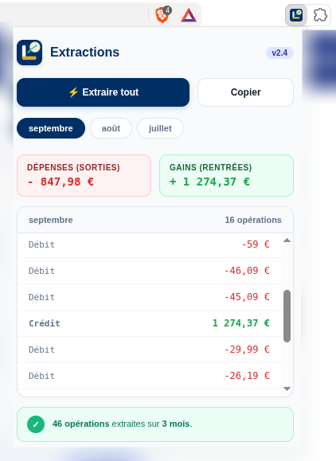

# LCL — Extrait d'Opérations Bancaires (Extension Chrome)

<p align="center">
  
</p>

Extension Chrome / Edge / Brave permettant d'extraire automatiquement, de calculer les totaux et de structurer l'historique de vos opérations bancaires depuis votre espace client **LCL**.

---

## 🚀 Fonctionnalités

- **Calcul automatique des Totaux** :
  - 💸 **Dépenses (Sorties)** : Additionne automatiquement toutes les opérations négatives du mois.
  - 💰 **Gains (Rentrées)** : Additionne automatiquement toutes les opérations positives du mois.
- **Découpage automatique par mois** : Récupère les vrais titres des mois affichés sur la page.
- **Interface moderne avec onglets** : Naviguez d'un mois à l'autre en un clic.
- **Copie rapide au presse-papiers** : Copiez la liste du mois sélectionné pour la coller directement dans Excel, Google Sheets ou votre gestionnaire de budget.

---

## 📂 Structure du projet

```text
├── manifest.json   # Configuration Manifest V3
├── popup.html      # Interface graphique de l'extension
├── popup.js        # Logique d'extraction et calculs
├── preview.png     # Aperçu pour le README
└── README.md       # Documentation
```

---

## 🛠️ Installation

1. Téléchargez et dézippez le fichier `.zip`.
2. Ouvrez votre navigateur et rendez-vous sur `chrome://extensions/`.
3. Activez le **Mode développeur** (en haut à droite).
4. Cliquez sur **Charger l'extension non empaquetée**.
5. Sélectionnez le dossier contenant directement le fichier `manifest.json`.

---

## 📝 Licence

[MIT License](LICENSE)
